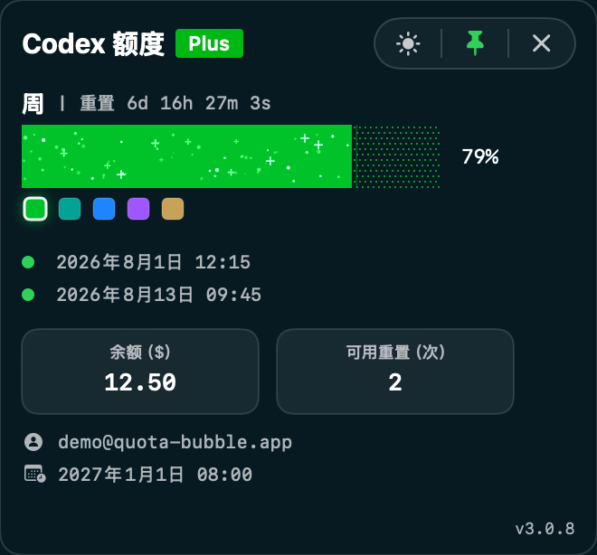

# Quota Bubble

[English](../README.md) | [中文](README.zh-CN.md) | [日本語](README.ja.md) | [한국어](README.ko.md) | [Deutsch](README.de.md) | [Français](README.fr.md) | [Español](README.es.md) | [Português](README.pt.md) | [Italiano](README.it.md) | [Nederlands](README.nl.md)

Una finestra nativa per macOS e Windows che mostra quota Codex di 5 ore, quota settimanale, reset, saldo, piano, account e ripristini disponibili.

## Funzionalità

- Mostra la quota di 5 ore quando presente, oltre a quota settimanale Codex, reset, saldo, piano e ripristini disponibili.
- Mostra dopo il conto alla rovescia la data esatta del reset settimanale e il giorno della settimana in ora locale, con precisione al secondo.
- Mostra nella barra dei menu macOS la percentuale della quota di 5 ore quando presente; altrimenti mostra quella settimanale.
- Chiudendo si nasconde solo la finestra; la quota continua ad aggiornarsi nella barra dei menu o nell’area di notifica. Per uscire usa il menu dell’app o dell’area di notifica.
- Su macOS mostra la scadenza di ogni ripristino, con un punto rosso entro tre giorni e verde negli altri casi.
- Su macOS mostra localmente l’account corrente e la scadenza dell’abbonamento senza salvare credenziali nello snapshot della quota.
- Mostra lo spazio di sistema e la memoria fisica disponibili; su Windows indica lo spazio libero dell’unità C.
- Mantiene stabili le quote live e impedisce la visualizzazione dei dati dell’account precedente dopo un cambio account.
- Funziona in modo indipendente e legge i dati locali della quota Codex.
- Ricorda posizione, tema e stato fissato.
- Un'unica app SwiftUI gestisce HUD, icona Dock, menu e ciclo di vita.
- Limita l’app a una sola istanza e una sola finestra quota, ripristinabile dalla barra dei menu o dall’area di notifica dopo essere stata nascosta.
- Aggiunge azioni di menu per aggiornare, disinstallare e cambiare lingua.
- Mostra un piccolo punto rosso accanto alla versione quando è disponibile una release GitHub più recente.
- Supporta tema chiaro e scuro.
- Segue automaticamente la lingua di sistema.

## Installazione

Apri il [sito ufficiale Quota Bubble](https://htmlpreview.github.io/?https://github.com/itzhaolei/codex-usage-widget/blob/main/public/index.html?v=20260719-1) e premi il pulsante principale. Il sito rileva macOS o Windows e scarica direttamente l’ultimo installer grafico senza aprire la pagina Releases.

### macOS

macOS 13 o successivo. Estrai `macOS-Installer.zip` e apri `Install Quota Bubble.app`. Non servono Node.js, npm, Codex CLI separato, Xcode o comandi. Codex deve essere connesso e aver creato `~/.codex/auth.json`.

### Windows

Windows 10 o successivo. Apri `Windows-Setup.exe` e segui la procedura grafica. Non servono PowerShell, Node.js, terminale o un runtime .NET separato.

## Disinstallazione

Su macOS usa **Quota Bubble > Disinstalla**. Su Windows usa **Impostazioni > App > App installate**.

## Privacy

Questo plugin viene eseguito localmente. L’app macOS legge solo in memoria il token Codex corrente da `~/.codex/auth.json` per richiedere al backend quota, saldo, piano e ripristini di quell’account. Il token non viene mai scritto nello snapshot e il repository non include credenziali personali né dati dell’account.
