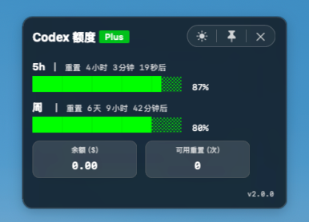

# Quota Bubble

[English](../README.md) | [中文](README.zh-CN.md) | [日本語](README.ja.md) | [한국어](README.ko.md) | [Deutsch](README.de.md) | [Français](README.fr.md) | [Español](README.es.md) | [Português](README.pt.md) | [Italiano](README.it.md) | [Nederlands](README.nl.md)

Codex의 5시간 사용량, 주간 사용량, 사용 가능한 재설정 횟수를 보여 주는 macOS 플로팅 창입니다.



## 기능

- Codex 5시간 사용량, 주간 사용량, 사용 가능한 재설정 횟수 표시.
- Codex 데스크톱 앱의 실행 및 종료에 맞춰 동작.
- 창 위치, 테마, 항상 위 상태 저장.
- HUD와 Dock 런처를 각각 하나만 유지.
- 메뉴에서 업데이트, 제거, 언어 전환을 지원.
- GitHub에 새 릴리스가 있으면 버전 표시 옆에 작은 빨간 점을 표시.
- 다크 모드와 라이트 모드 지원.
- 시스템 언어 자동 적용.

## 설치

### 방법 1: 앱 설치 프로그램

터미널을 사용하고 싶지 않다면 최신 Release 페이지를 열고 설치 프로그램 첨부 파일을 다운로드하세요:

[최신 Release 페이지 열기](https://github.com/itzhaolei/codex-usage-widget/releases/latest)

압축을 푼 뒤 `Install Quota Bubble.app`을 더블 클릭하세요. Codex Desktop은 미리 설치되어 있고 로그인되어 있어야 합니다.

README는 항상 최신 Release 페이지로 연결됩니다. 이전 버전을 설치하려면 [모든 Releases](https://github.com/itzhaolei/codex-usage-widget/releases)를 열고 해당 버전 페이지에서 설치 프로그램을 다운로드하세요.

### 방법 2: 한 줄 설치

```bash
CODEX_USAGE_WIDGET_URL=https://github.com/itzhaolei/codex-usage-widget/archive/refs/heads/main.tar.gz bash -c "$(curl -fsSL https://raw.githubusercontent.com/itzhaolei/codex-usage-widget/main/scripts/bootstrap-install.sh)"
```

### 방법 3: 로컬 설치

```bash
bash scripts/install.sh
```

## 제거

```bash
bash scripts/uninstall.sh
```

## 개인 정보

이 플러그인은 로컬에서 실행됩니다. 사용자의 Codex 로컬 세션 메타데이터와 `~/.codex/auth.json`의 현재 Codex token을 사용자의 재설정 횟수를 조회하는 용도로만 사용합니다. 이 저장소에는 개인 인증 정보나 계정 데이터가 포함되어 있지 않습니다.
