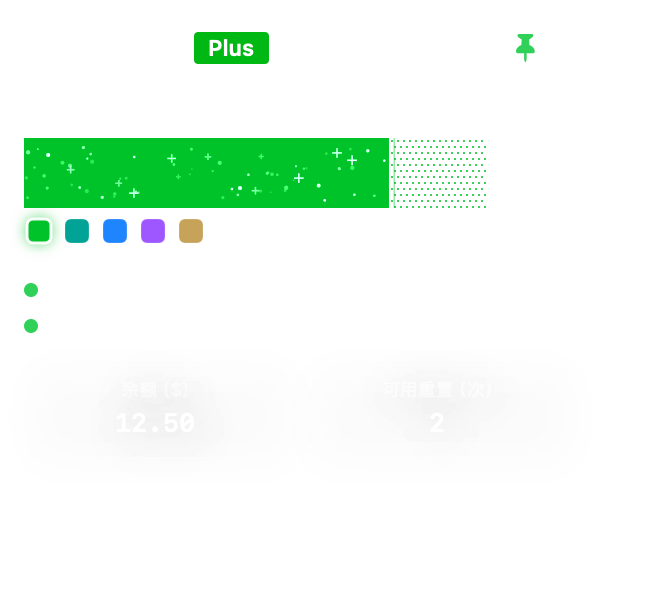

# Quota Bubble

[English](../README.md) | [中文](README.zh-CN.md) | [日本語](README.ja.md) | [한국어](README.ko.md) | [Deutsch](README.de.md) | [Français](README.fr.md) | [Español](README.es.md) | [Português](README.pt.md) | [Italiano](README.it.md) | [Nederlands](README.nl.md)

Uma janela nativa para macOS e Windows que mostra cota semanal do Codex, redefinição, saldo, plano, conta e redefinições disponíveis.

## Recursos

- Mostra cota semanal do Codex, redefinição, saldo, plano e redefinições disponíveis.
- No macOS, mostra a validade de cada redefinição, com ponto vermelho quando expira em até três dias e verde nos demais casos.
- No macOS, mostra localmente a conta atual e o vencimento da assinatura sem salvar credenciais no snapshot de cota.
- Mantém os valores estáveis ao alternar entre o uso ao vivo e o log de sessão local.
- Roda de forma independente e lê dados locais de cota do Codex.
- Lembra posição, tema e estado fixado.
- Um único app SwiftUI gerencia o HUD, o ícone do Dock, os menus e o ciclo de vida.
- Adiciona ações de menu para atualizar, desinstalar e trocar idioma.
- Mostra um pequeno ponto vermelho ao lado da versão quando há uma versão mais recente no GitHub.
- Suporta tema claro e escuro.
- Segue automaticamente o idioma do sistema.

## Instalação

Abra o [site oficial do Quota Bubble](https://htmlpreview.github.io/?https://github.com/itzhaolei/codex-usage-widget/blob/main/public/index.html?v=20260716-3) e clique no botão principal. O site detecta macOS ou Windows e baixa diretamente o instalador gráfico mais recente sem abrir a página Releases.

### macOS

macOS 13 ou posterior. Descompacte `macOS-Installer.zip` e abra `Install Quota Bubble.app`. Não exige Node.js, npm, Codex CLI separado, Xcode ou comandos. O Codex deve estar conectado e ter criado `~/.codex/auth.json`.

### Windows

Windows 10 ou posterior. Abra `Windows-Setup.exe` e siga o assistente gráfico. Não exige PowerShell, Node.js, terminal ou runtime .NET separado.

## Desinstalar

No macOS use **Quota Bubble > Desinstalar**. No Windows use **Configurações > Aplicativos > Aplicativos instalados**.

## Privacidade

Este plugin roda localmente. O app para macOS lê o token atual do Codex em `~/.codex/auth.json` apenas na memória para solicitar ao backend a cota, o saldo, o plano e as redefinições dessa conta. O token nunca é gravado no snapshot e o repositório não contém credenciais pessoais nem dados da conta.
